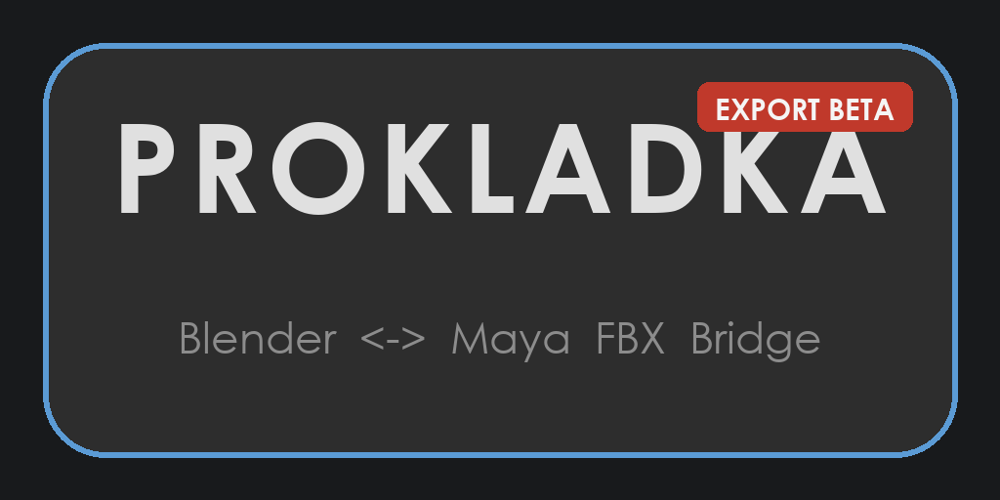

# PROKLADKA

> FBX-мост между Blender, Maya, Houdini и Unreal Engine.
> Naming presets, Universal UV renamer, Rig Transfer, авто-адаптация масштаба.



## Философия

**Ассет адаптируется под принимающую сторону, а не наоборот.**

Каждый DCC имеет свои конвенции. PROKLADKA конвертирует ассет при импорте:

| Принимающая сторона | Единицы | Naming | Пример |
|---------------------|---------|--------|--------|
| Blender | метры | lowercase + `_geo` | `wing_main_geo` |
| Maya | метры | lowercase + `_geo` | `wing_main_geo` |
| Houdini | метры | suffix `_geo`/`_vdb` | `wing_main_geo` |
| Unreal | сантиметры (×100) | PascalCase + `SM_` | `SM_WingMain` |

Отдающая сторона экспортирует в нейтральном формате (метры, Y-up, FBX).
Принимающая конвертирует под свои конвенции.

## Возможности

- **FBX I/O** — экспорт/импорт `C:\temp\<scene>_bridge.fbx` с общим recent-списком
- **Naming presets** — редактируемые пресеты нейминга (Default, Plain, Unreal, Dots, Rig)
- **Universal UV renamer** — конвенции Maya/Blender/Houdini/Unreal/Custom
- **Rig Transfer** — перенос рига через FBX + JSON recipe (constraints, control shapes)
- **Multi-format** — Houdini: FBX/VDB/Alembic/USD
- **Auto-scale** — Houdini: bbox check + auto-fix; UE: meters→cm ×100
- **UE import** — Static/Skeletal Mesh + Material Instance из PBR-текстур, dockable панель
- **Legacy scale** — escape hatch для чужих ассетов с необычным масштабом
- **PBR Texture Assigner** (Maya) — авто-распознавание слотов, UDIM, ACES colorSpace
- **Hierarchy** — Collection↔Empty, MayaRotate, Loc→Grp

## Установка

Скачай репозиторий (Code → Download ZIP) и распакуй. Дальше — по софту.

### Blender 4.5+

1. `Edit → Preferences → Get Extensions` → `≡` (справа вверху) → **Install from Disk…**
2. Выбрать `out/blender/prokladka.zip`
3. Включить **PROKLADKA**
4. N-панель во вьюпорте → вкладка **PROKLADKA**

### Maya 2022+

1. Перетащить `out/maya/install_prokladka.py` в viewport Maya
2. Появится диалог установки; перезапустить Maya
3. На полке **Custom** появится кнопка **PROKLADKA**

Инсталлятор self-contained: всё нужное встроено в файл, drag&drop работает
из любого расположения. Изменения подхватываются при каждом запуске панели.

### Houdini 20.5+

**Способ 1 — двойной клик:** открыть `out/houdini/install_PROKLADKA.bat` →
установит всё сам (файлы, пакет). Затем в Houdini: `+` в строке вкладок полок →
галка **PROKLADKA** (один раз).

**Способ 2 — вручную (2 шага):**

1. Скопировать `out/houdini/package/prokladka/houdini/` (целиком) →
   `C:\Users\<user>\Documents\houdini20.5\prokladka\houdini\`
2. Создать `C:\Users\<user>\Documents\houdini20.5\packages\prokladka.json`:

```json
{
    "env": [
        {"PROKLADKA": "C:/Users/<user>/Documents/houdini20.5/prokladka/houdini"}
    ],
    "path": ["$PROKLADKA"]
}
```

Запустить Houdini. Вкладки нет на полке? `+` в строке вкладок → галка **PROKLADKA**.

Подробности: `out/houdini/README_HOU.md`.

### Unreal Engine 5.6+

1. Скопировать `out/unreal/prokladka/` → `<UE_Project>/Content/Python/prokladka/`
2. Скопировать `out/unreal/init_unreal.py` → `<UE_Project>/Content/Python/`
3. Перезапустить UE. Включён плагин **Python Editor Script Plugin**
4. Toolbar кнопка **PROKLADKA** или `Window → PROKLADKA → Open Panel`

Подробности: `out/unreal/README_UE.md`.

## Структура

```
prokladka/
├── README.md, CHANGELOG.md, LICENSE
├── assets/                      ← логотип
├── out/                         ← дистрибутив
│   ├── blender/                 ← prokladka.zip (Extension, 4.5+)
│   ├── maya/                    ← self-contained installer + исходники
│   ├── houdini/                 ← Houdini Packages installer
│   └── unreal/                  ← Python-пакет для Content/Python
└── work/                        ← разработка (логотипы, сборка, референсы)
```

## Rig Transfer

FBX переносит геометрию/скелет/weights, recipe.json — логику связей:

```
rig_asset = FBX (geometry/skeleton/weights) + recipe.json (logic/connections)
```

Поддерживаемые типы constraints (mapping B↔M):

| Recipe | Maya | Blender |
|--------|------|---------|
| `parent` | parentConstraint | CHILD_OF |
| `point` | pointConstraint | COPY_LOCATION |
| `orient` | orientConstraint | COPY_ROTATION |
| `scale` | scaleConstraint | COPY_SCALE |
| `aim` | aimConstraint (+ up) | TRACK_TO |
| `aim_no_up` | aimConstraint (no up) | DAMPED_TRACK |

Custom control shapes переносятся как curve points (DCC-agnostic).

## Совместимость

| Софт | Версия | Примечание |
|------|--------|-----------|
| Blender | 4.5+ | Extension (manifest), Python 3.11 |
| Maya | 2022+ | PySide2/PySide6 автодетект |
| Houdini | 20.5+ | Houdini Packages, Python 3.11 |
| Unreal | 5.6+ | Python Editor Script Plugin |
| OS | Windows | пути `C:\temp\` хардкожены |

## Благодарности

- **STUKACH** — за визуальный стиль (Blender-dark QSS) и паттерн Qt panel
- **Ismailov Dmitry** — автор оригинального Maya-Blender bridge V6

## Лицензия

[GPL-3.0-or-later](LICENSE) — Maksim Kovalev
